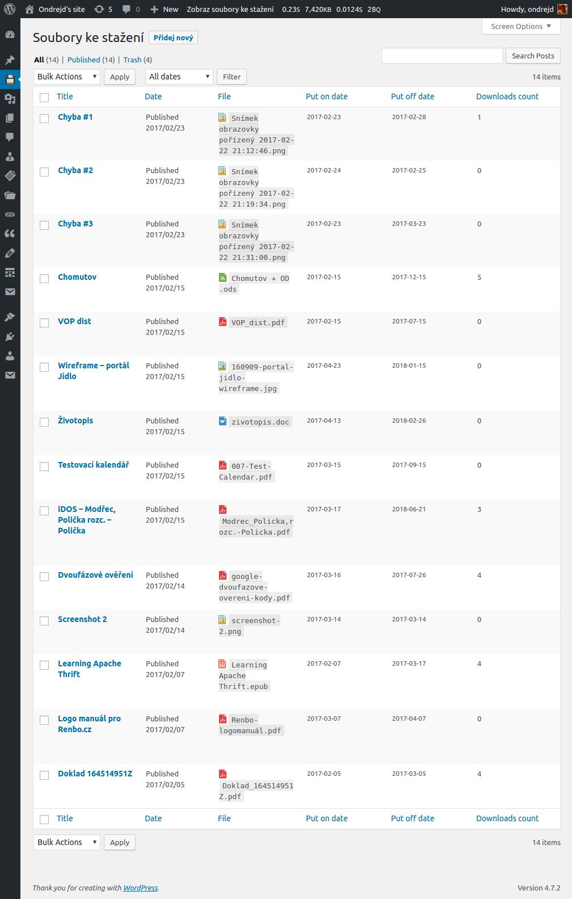
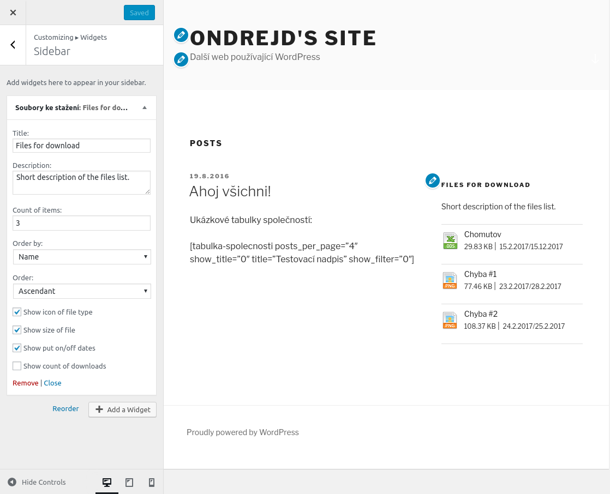
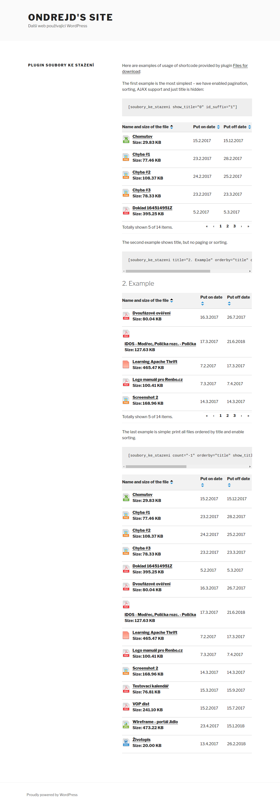

# Downloads Plugin

[WordPress](https://wordpress.org/) plug-in that allow to manage files that you want to offer to visitors of your pages for download. Allow to use either sidebar widget, shortcode with responsive table or using regular [WordPress](https://wordpress.org/) theme (downloads are _custom post types_ so you can make templates for them).

## Description

Main features:

- adds new [custom post type](https://codex.wordpress.org/Post_Types#Custom_Post_Types) that represents single item to download
- contains [shortcode](https://codex.wordpress.org/Shortcode_API) that renders responsive table with items to download
- contains [widget](https://codex.wordpress.org/Widgets_API) that prints list of items to download
- file types are specified by correct icon
- enables downloads restricted just for registered users
- offers simple download statistics
- enable tracking using [Google Analytics](https://www.google.com/analytics/)
- available with English and Czech locales
- tested on the latest [WordPress](https://wordpress.org/) versions (currently __4.7.2__)

Icons used for file types are taken from __FatCow Free Icons__ - for more details visit [https://www.fatcow.com/free-icons](https://www.fatcow.com/free-icons). __Thanks!__

## Instalation

Using automatic installation:

1. Go to _WordPress Administration - Plugins_ and click on _Install plugin_ button.
2. Find __Downloads Plugin__ and install it.
3. Than activate __Downloads Plugin__ plugin.

Using manual download:

1. Download plugin from original site - [https://wordpress.org/plugins/od-downloads-plugin/](https://wordpress.org/plugins/od-downloads-plugin/).
2. Unpack `od-downloads-plugin-0.6.zip` into plugins folder of your [WordPress](https://wordpress.org/) installation.
3. Go to _WordPress Administration - Plugins_ and activate __Downloads Plugin__ plugin.

## Screenshots

### List of existing downloads

### Add new download page

### Edit download page

### Page with widgets administration

### Entering our shortcode to the post

### Page with our shortcode and widget displayed

Here with normal desktop resolution:

Here on smaller screen:

